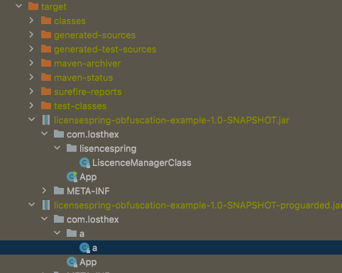
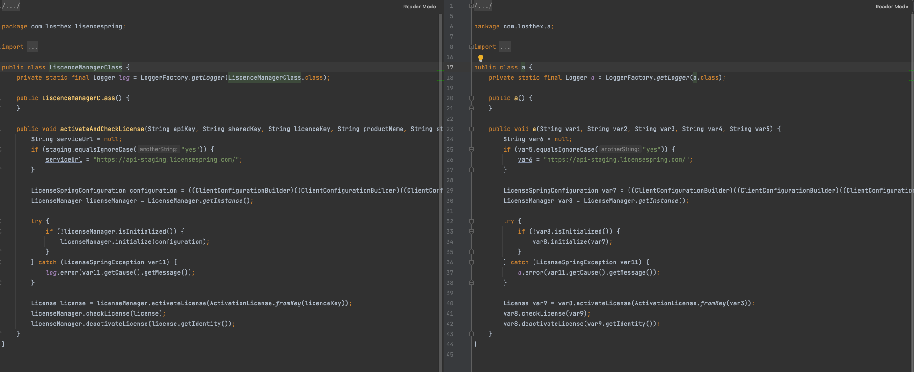

# licensespring-obfuscation-sample

This is a sample project demonstrating the use of LicenseSpring in a Java application. The project utilizes the LicenseSpring License Client library to manage license activation, checking, and deactivation.

## Prerequisites

- Java Development Kit (JDK) 8 or higher
- Apache Maven

## pom.xml

The project is built using Maven, and the dependencies are specified in the `pom.xml` file. The main dependencies include:

- `licensespring-license-client`: LicenseSpring License Client library
- `junit`: A testing framework for Java applications

The `pom.xml` also includes the `maven-assembly-plugin` to generate a JAR file with all dependencies and the `proguard-maven-plugin` to obfuscate the final JAR file.


## MyLicenseManager

The `MyLicenseManager` class is a simple wrapper around the LicenseSpring License Client library. It demonstrates license activation, checking, and deactivation.


## App (Main Class)

The `App` class is the main entry point of the application. It expects four command-line arguments, in order: `apiKey`, `sharedKey`, `licenceKey` and `productName`. Optionally `isStaging` (yes/no) can be input as a fifth command-line argument (defaults to no).

```java
public class App {
    public static void main(String[] args) {
        System.out.println("Starting...");
        MyLicenseManager licenseManagerClass = new MyLicenseManager();

        if (args.length != 5  && args.length!=4) {
            System.out.println("Four arguments required: apiKey, sharedKey, licenceKey, productName and optional isStaging(yes/no) variable");
        } else if (args.length==5){
            licenseManagerClass.activateAndCheckLicense(args[0], args[1], args[2], args[3], args[4]);
        } else {
            licenseManagerClass.activateAndCheckLicense(args[0], args[1], args[2], args[3], "no");
        }
    }
}
```

## Build

To build the project, run the following command in the project's root directory:

```sh
mvn clean package
```

This will generate a JAR file with dependencies and obfuscate the code using ProGuard. The resulting JAR file will be located in the `target` directory.



Picture below shows side-by-side comparison of LicenseManagerClass before and after obfuscation.



## Usage

Run the application using the command line, providing the required arguments:

```sh
java -jar target/licensespring-obfuscation-sample-1.0-SNAPSHOT-proguarded.jar <apiKey> <sharedKey> <licenceKey> <productName> <isStaging>
```

Replace `<apiKey>`, `<sharedKey>`, `<licenceKey>`, `<productName>`, and `<isStaging>` with the appropriate values for your LicenseSpring account and product. Use "yes" for `<isStaging>` if you want to use the staging API, otherwise use "no".
```